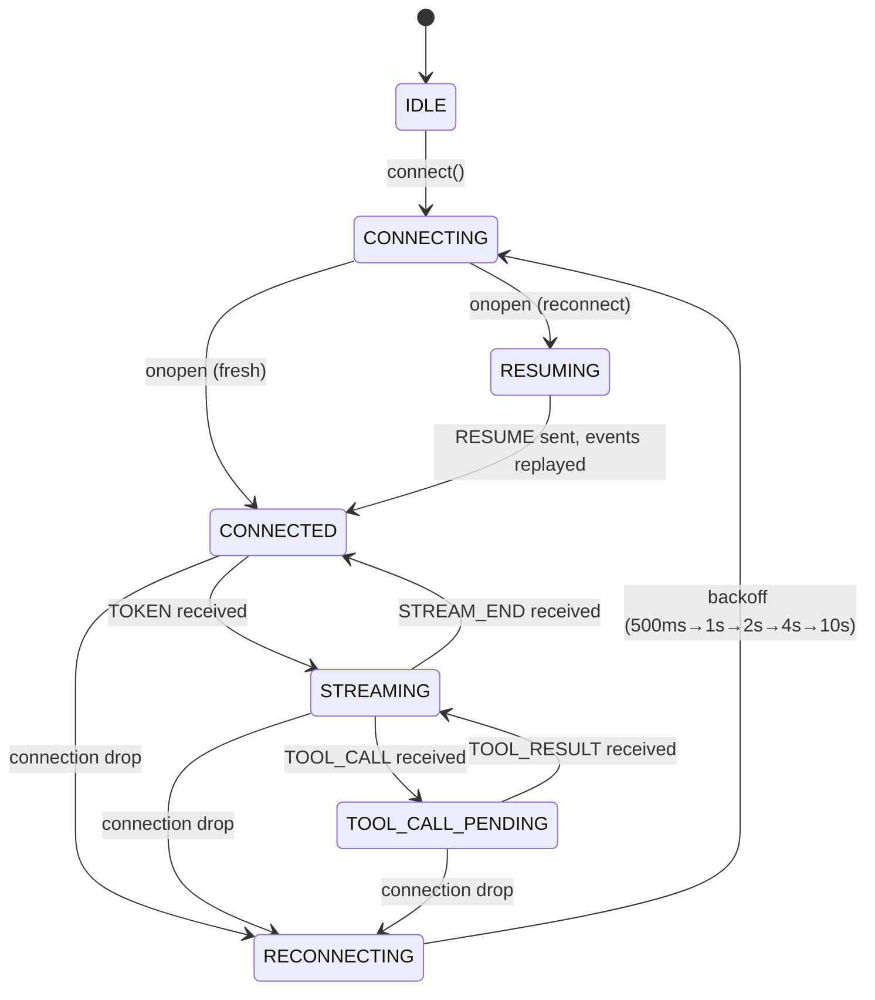
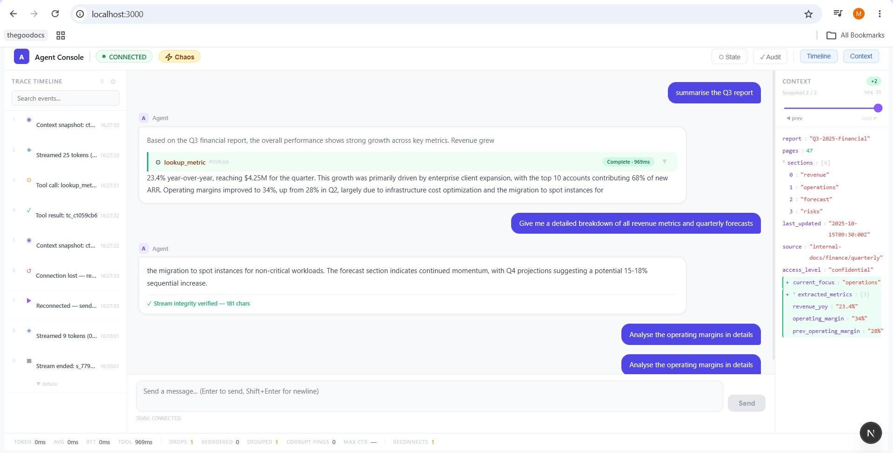
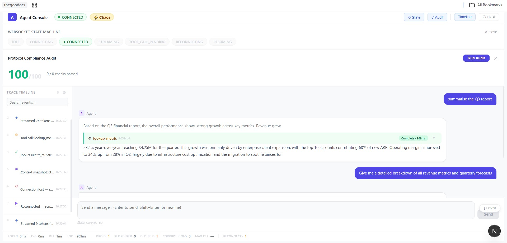
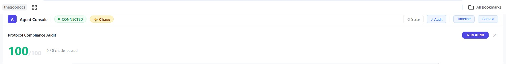

# Agent Console

A production-grade real-time AI agent debugging console that connects to the agent-server over WebSockets, renders streaming responses with mid-stream tool call interruptions, displays a live virtualized trace timeline, and survives chaos mode without crashing or losing state — while grading its own protocol compliance before you do.

## Architecture

The application is built around a singleton `WebSocketManager` that owns the connection lifecycle and delegates processed events through a `SeqBuffer` (reorder + deduplicate) to a `ProtocolHandler` state machine, which routes events to three Zustand stores. React components subscribe only to the slices they need.

### WebSocket State Machine (Mermaid)



## Prerequisites

- Docker installed and running
- Node.js 20+

## Running

```bash
# 1. Start agent-server (normal mode)
cd agent-server
docker build -t agent-server .
docker run -p 4747:4747 agent-server

# 2. Start the console
npm install
npm run dev
# Open http://localhost:3000

# Chaos mode
docker run -p 4747:4747 agent-server --mode chaos
```

## Tests

```bash
npm run test   # 23 tests: SeqBuffer (13) + JSON differ (10)
```

## Production Build

```bash
npm install && npm run build && npm run start
```

## Environment Variables (all optional)

| Variable | Default | Description |
|---|---|---|
| NEXT_PUBLIC_WS_URL | ws://localhost:4747/ws | WebSocket endpoint |
| NEXT_PUBLIC_SERVER_HTTP_URL | http://localhost:4747 | HTTP endpoint for /log audit |

## Features

### Core Tasks
- **Task 1** — Streaming chat with tool call interruptions (freeze/resume without layout shift, TOOL_ACK <2s)
- **Task 2** — Virtualized trace timeline, 30+ events/sec no jank, bidirectional click linking
- **Task 3** — Context inspector with JSON diff, history scrubber, lazy tree for 500KB+ payloads
- **Task 4** — Reconnect with RESUME, exponential backoff, corrupt PING safety, state stitching
- **Task 5** — All chaos scenarios handled (record your screen with chaos mode enabled)

### Bonus Features
- **Protocol Compliance Audit** — Click "Audit" → fetch /log → see 0-100 compliance score
- **Telemetry Bar** — Live token latency, RTT, tool duration, chaos stats
- **State Machine Visualizer** — Live state diagram highlighting current state
- **Stream Integrity Badge** — Post-STREAM_END rendered text verification

## Screenshots

**(a) Streamed response with tool call + context inspector showing a diff**



The agent's response froze mid-stream when `lookup_metric` was called, rendered the tool card with the result, then resumed streaming without duplication. The context panel on the right shows `current_focus` and `extracted_metrics` highlighted in green as newly added keys in this snapshot versus the previous one.

**(b) Trace timeline + live WebSocket state machine + protocol compliance audit**



Every protocol event (context snapshot, token group, tool call, tool result, reconnect, resume) is logged in the timeline on the left in real time. The state machine widget shows the current connection state highlighted. A connection drop and reconnect are visible as discrete timeline entries, confirming RESUME-based recovery worked during this session.

**(c) Protocol compliance audit panel**



Clicking "Run Audit" fetches `/log` from the agent-server and scores client protocol compliance against the server's own ground-truth log.
